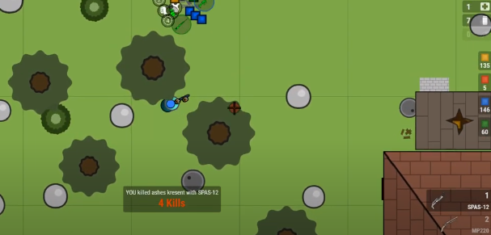
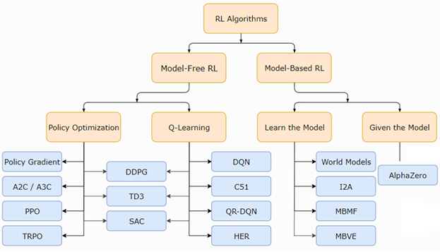

## Проект: создать RL-агента для этой [игры](https://surviv.io/).

*Работа над проектом ведется исплючительно для изучения ИИ и его возможностей*

### Зачем?
1) совместить CV и RL. Алгоритм анализирует текущее состояние агента (экран игры) и выбирает подходящие действия, которые приведут его к победе;
2) заботать RL подходы. Применить те, которые могут сработать для этой задачи. Мб изобрести свой велосипед, который как-то поедет;
3) для понимания RL лучше всего подойдут игры atari и [gym](https://gym.openai.com/), но хочется попробовать сделать что-то более крутое (но не такое крутое, как Dota2 от OpenAI);
4) сэмулировать работу в стартапе;
5) хайпануть на battle royale играх;
6) добавить в резюме
7) for fun

### Ограничения
1) нет никакого энвайрмента,  т.е. нельзя закинуть нескольких ботов на отдельный сервер для игры с самими собой для обучения (мы не разработчики игры);
2) если бота закинуть в игру через selenium и заставить обучаться, то потребуется слишком много времени для получения хоть какого-то результата.

### Возможный подход
1) предобучить агента на [видеозаписях-летсплеях](https://www.youtube.com/watch?v=ERDmPJ_0QJc&t=) некоторых игроков с помощью методов, позволяющих использовать чужой опыт. После дообучать агента в реальной игре с другими игроками.
2) чтобы предобучить агента по видео, нужно знать state (картинка) и action(s) в каждый момент времени. Поэтому нужно вытащить информацию, что делает игрок в каждый момент времени (заняться видео-аналитикой).
3) перейдем к созданию данных на основе реплеев. хочется нарезать видео на кадры (= состояния), чтобы получить обучающие четверки: (состояние1-действие-состояние2-награда).
4) вид награды будет определяться тем, какое поведение агента мы хотим увидеть в конце обучения.

### Дополнения
1) это открытый репозиторий для демонстрации прогресса и некоторых результатов. Он состоит из jupyter notebook для наглядности.
2) ниже Вы можете ознакомиться с динамическим чек-листом задач, которые наша команда ставит перед собой.
3) мб понадобятся [текстуры](https://drive.google.com/drive/folders/1qhaDdNCsisBu_7gvMNmyn_zkG4kyAZix) от разработчиков.
______________________________________________________________________________

#### CV-Задачи для создания обучающих данных:
- [x] 1)  Распознавать направление движения и нажатие клавиш [W][A][S][D] [Видео-демонстрация](https://youtu.be/L1n8TJr-sak) работы алгоритма
- [x] 2)  Распознавать координаты курсора [Демонстрация](https://www.youtube.com/watch?v=rUxV7hw5sqc&ab_channel=Laggg%2FAlexeyKlokov)
- [x] 3)	Распознавать цифры для распознавания: (detect_numbers_demo.ipynb файл)
  - лутания предмета (или выбрасывания) 28x28 32x32 в патронах
  - стрельбы
  - зума
  - уровня каски, брони и рюкзака
  - количества фрагов
  - количества оставшихся в живых игроков
- [x] 4) Распознавать, на каких кадрах карта открыта во весь экран (для сохранения инвентаря в последнем состоянии)
- [x] 5) Распознавать % HP и % SP (detect_hp_sp_demo.ipynb файл)
- [x] 6) Распознавать использование предмета (в центре экрана появилась табличка "Using...") и перезарядку оружия (в центре экрана появилась табличка "Reloading...") (detect_using_reloading_demo.ipynb файл)
- [x] 7) Распознавать открытие/закрытие всех дверей (в центре экрана появляется табличка "Open/Close...") (detect_open_close_door_demo.ipynb файл)
- [x] 8) Распознавать активное оружие, которое игрок держит в данный момент (1,2,3 или 4) (detect_active_weapon_demo.ipynb файл)
- [x] 9) Распознавать лутание нового оружия 
- [x] 10) Распознавать атаки рукой/холодным оружием (detect_hand_attack_demo.ipynb файл)
- [x] 11)	Сделать общий пайплайн обработки одного летсплея (laggg_main_pipeline.ipynb файл). Все алгоритмы выше работают с определенными областями на каждом кадре. Координаты областей не изменяются на протяжении одного видео, но могут меняться от одного видео к другому (масштаб интерфейса разный).
- [x] 12) Решить, что делать с разными координатами областей для всех цифр и надписей ---> привлекаем разметчиков (даже если строить модель детекции/поиска интересующих областей, то нужны размеченные данные)
- [x] 13) Разметчиками размечено 99/99 видео (вся разметка проверена)
- [x] 14)	Создать базу данных видосов, создать датасет кадров на сервере. Получить разметку для обучения движению. Дорабатывать другие алгоритмы для улучшения разметки
- [x] 15) подобрать архитектуру энкодера для сжатия картинок [демонстрация](https://www.youtube.com/watch?v=wBjNGPV2ZI0)

#### RL-Задачи для выбора и реализации алгоритма:
- [x] 1) DQN для google dino (CV+RL)
- [ ] 2) адаптировать DQN
- [ ] 3) Чекнуть, какую архитектуру обучали OpenAI для Dota2 (big LSTM?) и каким образом
- [ ] 4) Посерчить другие алгоритмы, позволяющие использовать чужой опыт
- [ ] 5) simple Behaviour cloning (1 pair (s,a) or sequence pairs [(si,ai)]) https://arxiv.org/pdf/1605.08478.pdf (https://arxiv.org/pdf/1801.06503.pdf)
- [ ] 6) AQIL https://arxiv.org/ftp/arxiv/papers/2004/2004.00993.pdf
- [ ] 7) Model-Free Imitation Learning with Policy Optimization https://arxiv.org/pdf/1605.08478.pdf
- [ ] 8) Behavioral Cloning from Observation https://arxiv.org/pdf/1805.01954.pdf
- [ ] 9) Integrating Behavior Cloning and Reinforcement Learning for Improved Performance in Dense and Sparse Reward https://arxiv.org/pdf/1910.04281v1.pdf
- [ ] 10) Adapt https://pdfs.semanticscholar.org/7f81/d161d97897e93a979395ffa3b3124f0d4e94.pdf?_ga=2.199838759.860601702.1599318537-259032781.1595773256
- [ ] 11) IRL methods
- [ ] 12) DQFD, DQFID (с прошлогоднего соревнования по Майнкрафту)
- [x] 13) Default Behavior Cloning для передвижений [презентация](https://www.dropbox.com/s/3hd7e4k8fdgrhz7/RLsurvivio_Laggg.pptx?dl=0) и [видео-демонстрация](https://www.youtube.com/watch?v=Mm-jnoGctT4)

#### DevOps-Задачи:
- [x] 1) Научиться управлять агентом через selenium. [Демонстрация1](https://youtu.be/gI4StjHpRE8),[демонстрация2](https://youtu.be/vWEUXgCRhzU) игры агента который в каждый момент времени выбирает рандомное направление движения. [Демонстрация3](https://www.youtube.com/watch?v=CCqYR7BVFbI) реплея агента, который 2-3 раза в секунду совершает рандомные действия (направление движения, направление взгляда, удар, лут и тд)
- [x] 2) Потестить время отклика сайта после команды селениума
- [x] 3) Подготовить скрипт, управляющий агентом через селениум (все кнопки и кликанья мышкой)
- [x] 4) Решить, как будем получать состояние инвентаря агента в реальной игре. Часть всех элементов вытаскиваем через парсинк кода страницы html, а всё, что не удалось таким образом вытащить - через алгоритмы из нашей библиотеки для детекции действий по видео.
- [ ] 5) Найти платформу/сайт/другое для того, чтобы любой человек мог наблюдать за действиями запущеного агента в реальной игре (мультиплеер)
